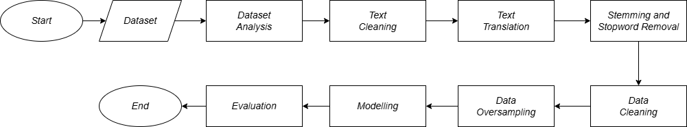
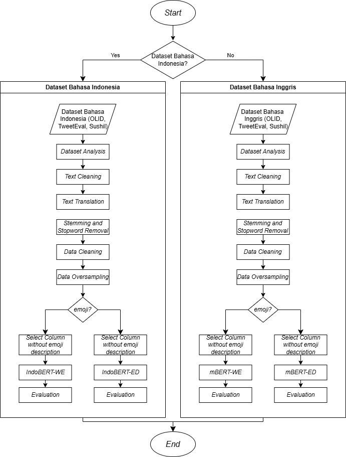
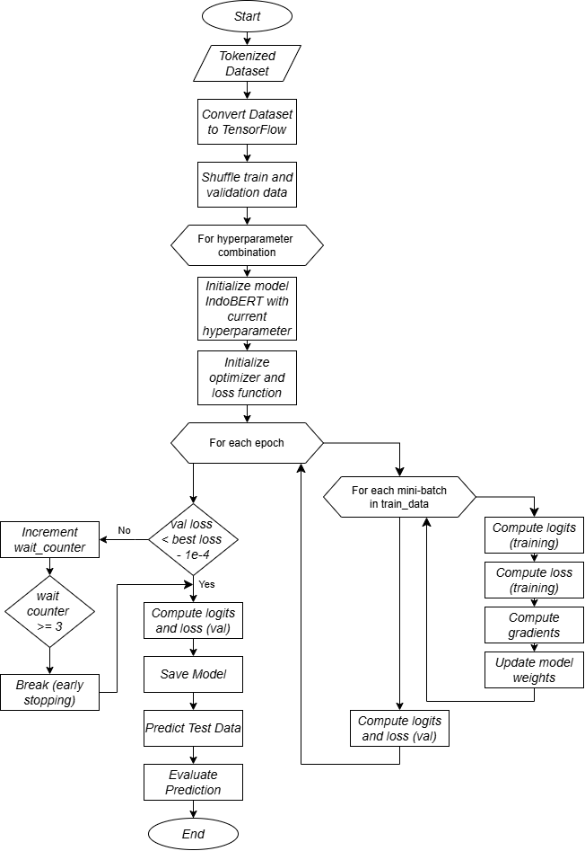

<h1 align="center">Analisis Peran Emoji pada Klasifikasi Ujaran Kebencian Dalam Bahasa Indonesia Menggunakan Model IndoBERT dengan Emoji Description</h1>

  <em>Tugas Akhir - Program Studi Sistem Informasi, Institut Teknologi Del</em>

---

## 🧠 Latar Belakang

Emoji adalah bagian penting dari komunikasi digital modern. Namun, mereka juga bisa digunakan untuk menyamarkan ujaran kebencian. Penelitian ini menyelidiki peran emoji dalam klasifikasi ujaran kebencian dalam Bahasa Indonesia, dengan memanfaatkan model IndoBERT yang diperkaya dengan informasi **emoji description**. 

Selain itu, model multibahasa **mBERT** juga digunakan untuk membandingkan efek translasi terhadap performa klasifikasi.

---

## 🎯 Tujuan Penelitian

✅ Menganalisis peran emoji dalam memperkuat atau mengubah konteks ujaran kebencian.  
✅ Mengevaluasi dampak penggunaan deskripsi emoji terhadap kinerja model IndoBERT.  
✅ Mengeksplorasi pengaruh hyperparameter (batch size, learning rate, epoch) terhadap performa model.  
✅ Membandingkan hasil klasifikasi dengan MBERT sebagai baseline terhadap data asli berbahasa Inggris.

---

## 🧾 Dataset

Data yang digunakan adalah tweet berbahasa Inggris yang diterjemahkan ke dalam Bahasa Indonesia. Dataset berasal dari:

- **HateEmoji** – dari christophsonntag  
- **TweetEval** – Hate & Offensive (oleh CardiffNLP)  
- **Emoji-Based Hate Speech** – oleh Sushil Dalavi et al.

---

## ⚙️ Teknologi yang Digunakan

| Komponen            | Teknologi                          |
|---------------------|------------------------------------|
| Model NLP           | IndoBERT-lite-base, mBERT           |
| Tokenisasi          | BertTokenizer                       |
| Emoji Handling      | `emoji.demojize()`                  |
| Text Processing     | Sastrawi (Stemming, Stopwords), NLTK, SnowballStemmer     |
| Resampling          | SMOTE                               |
| Evaluasi            | Accuracy, Precision, Recall, F1-Score |

---

## 🔧 Hyperparameter Combination

- **Batch size**: `16`, `32`
- **Learning rate**: `2e-5`, `3e-5`, `5e-5`
- **Epoch**: `2`, `3`, `4`

---

## 🧪 Daftar Eksperimen

Eksperimen terbagi dalam 24 skenario:

1. IndoBERT + Emoji (3 Dataset, Bahasa Indonesia dan Bahasa Inggris)
2. IndoBERT tanpa Emoji (3 Dataset, Bahasa Indonesia dan Bahasa Inggris)
3. mBERT + Emoji (3 Dataset, Bahasa Indonesia dan Bahasa Inggris)
4. mBERT tanpa Emoji (3 Dataset, Bahasa Indonesia dan Bahasa Inggris)

---

## 🧪 Desain Umum & Desain Eksperimen

Desain Umum:
 

 

Desain Eksperimen:
 

---

## 🔧 Desain Model IndoBERT dan mBERT

Desain IndoBERT:
 

 

Desain mBERT:
 

---

## 👩‍💻 Tim Peneliti

- **Walker Valentinus Simanjuntak** – 12S21012  
- **Ruth Marelisa Hutagalung** – 12S21046  
- **Lamria Magdalena Tampubolon** – 12S21055  

📍 Program Studi Sarjana Sistem Informasi  
📚 Fakultas Informatika dan Teknik Elektro  
🏫 Institut Teknologi Del

---
